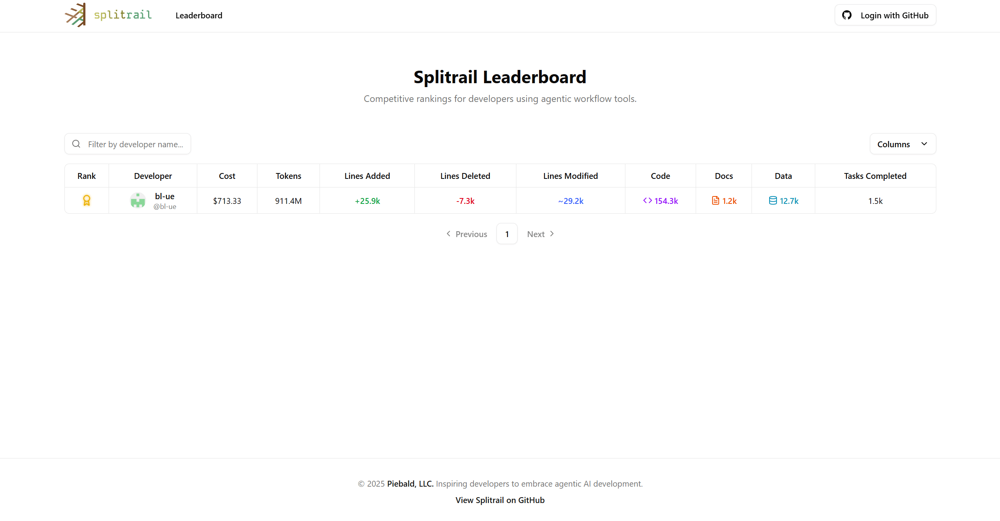

# Splitrail

Blazing fast, single-executable, cross-platform, agentic development monitor.  Supports Claude Code, Gemini CLI, and Codex (and more coming soon), and integrates with the Splitrail Leaderboard.

> [!WARNING]
> While support for both Gemini CLI and Codex **is** implemented, neither tool currently implements the necessary functionality to make them work with Splitrail: Codex does not output enough information to its recorded chat files, and Gemini CLI does not automatically record conversation history at all.  PRs are open for both, however: https://github.com/openai/codex/pull/1583 and https://github.com/google-gemini/gemini-cli/pull/4401.  React with :+1: on them to encourage them to be merged!  `ccusage` equivalent for Gemini CLI and Codex, as well as Claude Code.

The Splitrail CLI can automatically upload usage data to the [Splitrail Leaderboard.](https://splitrail.dev/leaderboard)

Also check out our developer-first agentic AI experience, [Piebald](https://piebald.ai/).

## Screenshots

### [Splitrail CLI](https://splitrail.dev)


### [Splitrail Leaderboard](https://splitrail.dev/leaderboard)


## Development

### Windows

On Windows, we use `lld-link.exe` from LLVM to significantly speed up compilation, so you'll need to install it to compile Splitrail.  Example for `winget`:

```shell
winget install --id LLVM.LLVM
```

Then add it to your system PATH:
```cmd
:: Command prompt
setx /M PATH "%PATH%;C:\Program Files\LLVM\bin\"
set "PATH=%PATH%;C:\Program Files\LLVM\bin"
```
or
```pwsh
# PowerShell
setx /M PATH "$env:PATH;C:\Program Files\LLVM\bin\"
$env:PATH = "$env:PATH;C:\Program Files\LLVM\bin\"
```

Then use standard Cargo commands to build and run:

```shell
cargo run
```

### macOS/Linux

Build as normal:
```
cargo run
```


-----

© 2025 [Piebald LLC](https://piebald.ai). All rights reserved.
