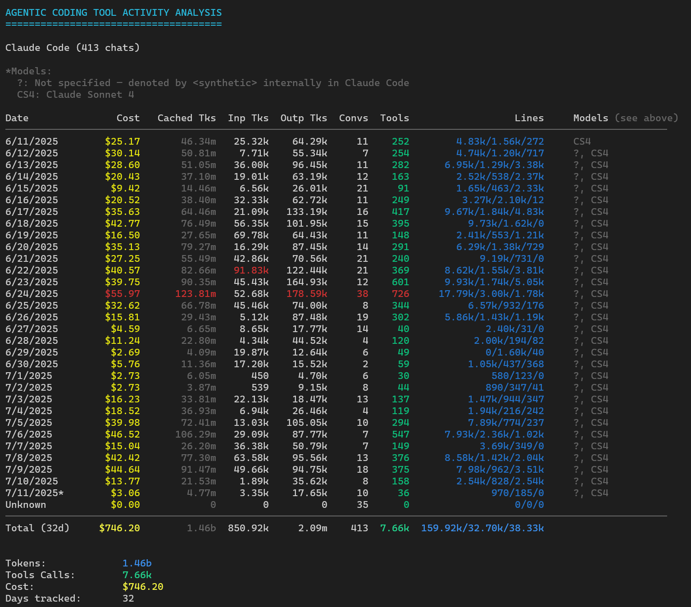

# Splitrail

Analyzer for agentic AI coding tool usage.  Currently supports Claude Code.

The Splitrail CLI can automatically upload usage data to the [Splitrail Leaderboard.](https://splitrail.dev/leaderboard)

Also check out our developer-first agentic AI experience, [Piebald](https://piebald.ai/).

## Screenshots

### [Splitrail CLI](https://splitrail.dev)

### [Splitrail Leaderboard](https://splitrail.dev/leaderboard)

